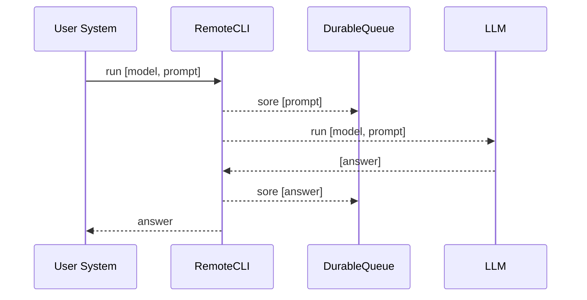

### Why such a CLI tool is useful in a production deployment, like Kubernetes?

## Ollama Tool

Ollama tool could be accessed via:
1. CLI interface or 
2. an HPP interface

However, the HTTP interface doesn't require AAA (Authentication, Authorization and Audit) so it's port should not be exposed in the production.

Use of an foundation model requires quality assurance and data collection for validation and training.

Having remote access to this tool, either via 2-way streaming, streaming prompts and results to a durable queue achieves the following goals:
*   place to audit User (OAuth2, MFA) and protect from unwanted access to the model.
*   place to validate and collect prompts
*   composing the models: 
    *   using previous conversation as context for the next prompt
    *  stream results first to a judge, either custom NLP or a different foundation model to validate quality of answers. 
    *   scaling up: keeping each container stateless

Additional benefit of changing this tool into a remote client is eliminating the need for a SSH connection to the container and eliminating the risks of malicious access or of a coding/typing error causing execution of unwanted commands in the container or on the server, for example,  [see](https://google.github.io/building-secure-and-reliable-systems/)

However, if this is used as full remote admin tool on persistent containers, at least the  `delete` command would need to be implemented and probably the `ps`.("what models are running?") command.

An exchange with remote CLI can look like this:

## Internal Testing in Container

Ollama CLI is used as a health check.

Similarly to the previous option, the tool can run `list` and `ps` on a schedule or on 
the startup.